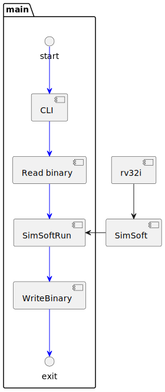
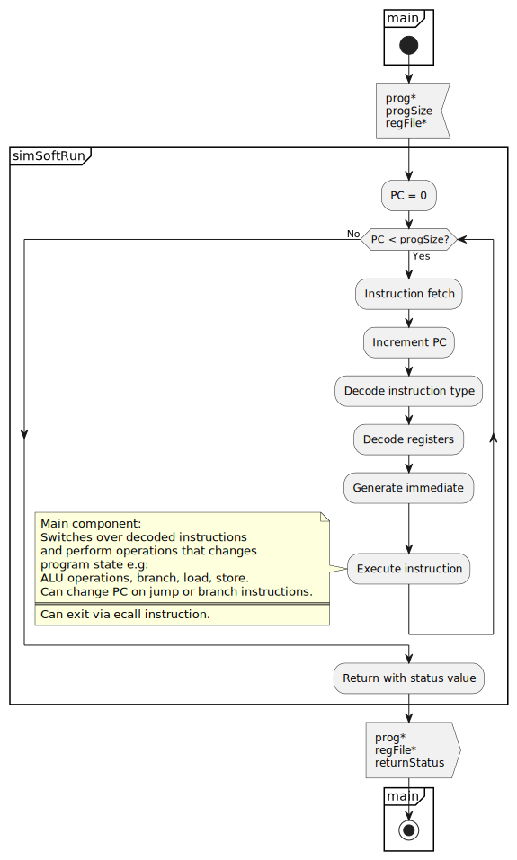
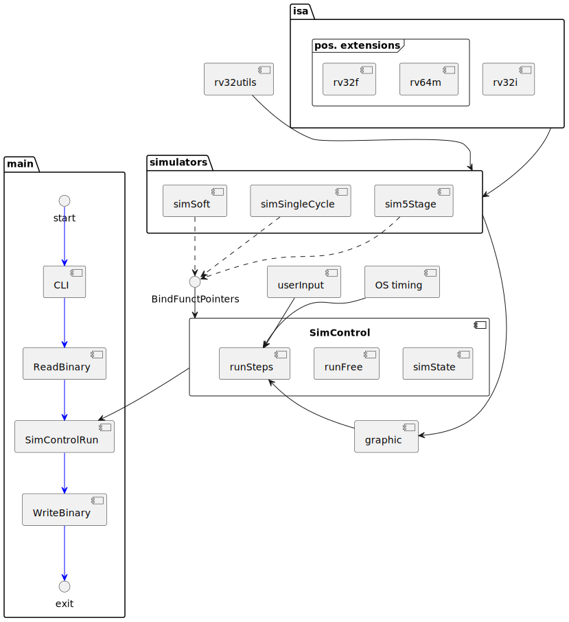

# Design
Here I will present the different design for RiVIS. I will start by listing the functionalities I believe are necessary to solve the problem, and the functionalities that would be nice to have.
From this I will present two designs; a Minimum Viable Product that solves the assignment specification and has the necessary supportive functionalities, and an ideal design as I would like to implement it given unlimited time.

## Necessary functionalities
A program solving the problem can be made from the following componenets:

- A command line interface that can takes an input file and an output file.
- Support for reading a binary input file to memory.
- The actual RISC-V ISA simulator.
- Support for writing the registers to a binary file.

Furthermore the project must support the following features for convenience:

- Version control with Git + A remote repositiory
- A make-file with instructions to compile the program.
- Inclusion of system test files to verify correct simulator implementation.

## Desireable improvements
The following represents the "nice-to-have" additions I would like to implement in my simulator. They are loosely ranked from simple to most advanced.

- CLI support for programe usage.
- Verbosity support; CLI and printing of runtime information
- Debug information on simulator error, e.g. `fwrite` failure, or on reading unknown instruction.
- Automated unit tests.
- Automated system tests of binary programs with known results.
- Support for Continuous integration
- Add SingleCycle simulator implementation
- Add 5 stage pipelined simulator implementation
- Option to single step simulation.
- Implement an ASCII UI that displays processor state.

## MVP design
A component diagram for a design that present the necessary functionalities are given below:

The blue arrows in main shows the order of execution of the components in main. Black arrows shows how components depends on functionalities delivered by other components.

### CLI
The component repsonsible for interpretation of the command line arguments. It will be based around the C library `getopt`.
Must take the arguments `-i IN_FILENAME -o FILENAME` for in- and output files. Helpfull additions would be to include `-h` for help/usage, and `-v` for verbosity.
Should included checks on inputs.

### ReadBinary
Read the instructions into program memory. Based on standard library functions for file input and output in `stdio.h`.
1 MiB of memory will be dynamically allocated, zero initialised, and have the binary input file read into the lower addresses.
Must include checks on success of memory allocation and file read.

### WriteBinary
Analog to `ReadBinary` WriteBinary must write the register file to disk before exiting the program.

### rv32i
A collection of defines, types, and functions generally useable across multiple types of RISC-V RV32I simulator implementations.
Holds all functions that works directly on the 32-bit instructions, e.g. `uint8_t  rv32iGetOpcode (int32_t instruct)`, as well as load/store functionalitites.
The goal of this library is to isolate the common functionalities in one place for reuse and testability.

I would argue that the scope of this code unit has grown too big, mixing both opcodes and types specific for RV32I instructions with generally useable functions for working on instructions. A better solution would be to seperate the later into a `rv32utils` file.

### SimSoft
The software simulation of the RISC-V processor. Given an input program, it must simulate the state changes (register and memory) that an actual processor would create for the same program.
The component is based upon the division of a 5 stage processor with Instruction Fectch (IF), Instruction Decode (ID), Execute (EX), Memory (MEM), and Writeback (WB) stages.
However, to simplify the implementation, Execute, Memory, and Writeback have been merged into one.
Heavely makes use of rv32i types and functions.

Besides a couple of small helper functions, simSoft mainly implements two things:
1. instructionExecute() which is a big switch statement over the decoded instruction type, that then do calculations, store results to memory/register, and possible updates the Program Counter on jump or branch instructions.
2. Implements `simSoftRun`, which is a while-loop that continiously call the stages IF->ID->EX/MEM/WB untill end of program.

A flow diagram of the simSoftRun function is given below:

## Ideal solution

### What would be desireable improvements from MVP?
The main point of RiVIS is to explore the workings of a simple RISC-V processor via software simulation. From that point of view I mainly miss two major functionalities:

1. A visual interface to see the internal workings of different components of the processor. This would allow users to enjoy the processor implementation without reading the code implementation, making it avaiable to a much larger audience.
2. A realistic implementation of a processor that mimics a real data- and control path. This would give a more proper representation of what actually happens, and fit well with the GUI implementation.

To allow for these features RiVIS would have to be expanded with the following functionalitites:
- A more realistic processor implementation.
- A GUI to see the processor state.
- A run mode that allows the processor to be single stepped (or possible run on a low frequency order of magnitude 1 Hz)

#### More realistic processor implementation
The current softSim only partially resembles an actual processor. This could be much improved by implementing control- and datapath for a single cycle, or 5 stages pipelined, processor.
While implementing a 5 stage pipelined processor is a more complex system than a single cycle version, it does have some synergies with respect to exposing the processor state as will be needed for the graphics.

Instead of replacing the current sofware simulator entirely it would be beneficial to expand the program to have multiple processor simulators avaiable, and let the user choose via the CLI. This would allow for better insights into what a processor is, by being able to showcase different implementations of a similar system.

#### Graphic display
The simplest graphic implementation would be draw the processor in ASCII art and print it to the terminal. The graphic functionality should be able to differentiate and handle all implemented processor simulators.
This could then be replaced later by actual graphics if one such desired.

Having a graphics places an important requirement on the simulator implementations: In order for the graphic module to draw which processor paths are active with what values, the processor simulators must expose their current state to the outside (read-only.)

#### Stepped run-mode
For a GUI to be meaningfull it must visualise the processor at a speed which humans can deal with.
This can be achieved by allowing the processor simulation to be stepped, such that one step represents one clock cycle.
This can then be exposed to the user, allowing them to either single step the processor execution at their leisure, or by letting them execute it at a slow frequency.

To allow this, the program must be able to capture keyboard inputs.
While running at a fixed frequency can be implemented in a number of ways, good solutions would probably require the program to make use of the OS for sleeping the thread for a period, and possibly make use of an OS timer for timing the steps.

### Ideal solution overall design
The component diagram below shows an overall design the could implement the more ideal RiVIS solution.

It features a number of changes from the MVP solution with the main one beeing the introduction of a `simControl` component.
The role of `simControl` is to handle the inputs from main, set up the appropiate simulator, and execute the simulator (free run or single step), close the simulator, and return status and register output to main.
`simControl` is to hold the simulator state exposing it to the simulator itself, and the graphics module.
Which simulator to run will be evaluated run-time, and connected by binding the appropiate function pointers.

Other noteworthy changes are drawing functionalities from `rv32i` into `ri32utils`, the potential addition of further instruction sets, and the close dependency between the graphic function and the simulator implementation.
The point of showing possible extensions to the instruction set is not that I anticipate to implement them, but rather to demonstrate that `rv32i` should be implemented as one of many possible instructionsets to include.

As evident from the many links in the figure, the biggets challenge will be a good implementation of the stepping functionality in `simControl`. For that reason it will be given further attention below.

#### SimControl runSteps
The expected user experience of runSteps is that the user is looking at the graphics showing the processors state, and that the user can interact with it using the keyboard.
runSteps can either be set in a user stepped mode, where it is awaiting user input to step, or it can be set to a frequency step mode.
Allowed key-presses could be SPACE for pause/run, and the RIGHTARROW key for stepping the processor. A reasonable implementation could also be to combine the two, such that a paused simulation can be stepped with RIGHTARROW, and likewise any stepped processor can be set to run by frequency using SPACE.

One problem with the runSteps functionality is how to receive the keyboard inputs. The expected options are something along the lines of
1. Block until a character is received.
2. Setup the OS to interrupt at keyboard input.
3. Us an OS timer to periodically poll an input buffer.

Another related problem is how to implement timing to step the simulator with a given frequency. Expected options are:
1. Sleep the thread for the wait period (infinite for a user stepped simulator).
2. Setup an OS timer to tricker an interrupt when the wait period is over.

From the above options, it becomes evident that the two problems are related.
It is only possible to sleep the thread if the OS will interrupt the sleep when a keyboard input is given.
Likewise, if the keyboard input is polled in a blocking fashion, the OS must interrupt this when the wait period is over.

While blockingly waiting for a keyboard would not be critical to this program implementation it needlessly consumes system ressources and should be avoided if possible. For this reason, the prefered solution would be to have an interrupt at keyboard presses, and then sleep the thread for the desired wait period.

How this will actually be implemented depends largely on what functionalities the OS exposes. Further research and experimentation is required before I can come to a conlcusion on this. It should be noted that this OS dependency will require two implementations are supported if RiVIS is to be able to run cross-platform. This could be done using defines controlled from the CMake build environment.

#### SimState
An interesting question is how to keep the simulator state in SimControl. The control only needs to pass the state to the simulator, the graphics module, and possibly extract the register file at end of program (this could also be done by the simulator module). As such it does not need to know about the content of the state.
For this reason the simulator should expose an "initState" and "stateClean" function, and return a pointer to the state. The control module then only have to pass the pointer around, and inform the graphic module which processor simulation is running.
